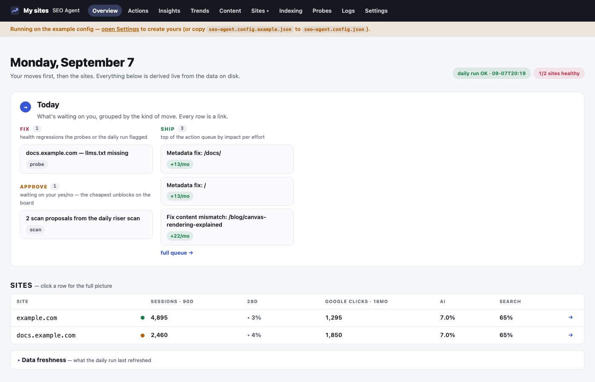

# n-seo

**An SEO, self-hosted.** Website: https://n-seo.dev/ · From the makers of [n-dx](https://n-dx.dev).

[](https://www.npmjs.com/package/n-seo)
[](https://github.com/en-dash-consulting/n-seo/actions/workflows/ci.yml)
[](LICENSE)

A local-first control plane for growing organic traffic to your own sites —
classic search (SEO), answer engines (AEO) and AI assistants that cite sources
(GEO) — without paying an agency to read Search Console for you.

It pulls Search Console and GA4 into local JSON, probes your live sites for the
things that quietly break (robots, sitemap, soft 404s, blocked AI crawlers,
JS-only shells), and turns all of it into a **ranked queue of concrete actions**:
which page to retitle, which query to answer, which page never got crawled.
It runs on hardware you control, on a schedule, and shows you the result on a dashboard.

- **Your data stays on your own hardware.** Nothing is sent anywhere except the
  Google APIs you authorize and, optionally, a local LLM command you choose.
- **It briefs you; it never posts for you.** Community modules find threads
  and write a briefing. The words are always yours.
- **It proposes; you ship.** No module edits your site. The queue tells you
  what to change and why, with the numbers; you make the change in your own
  repo and the next day's data tells you whether it worked.



## Quickstart (5 minutes, no Google setup)

```sh
npm install -g n-seo
n-seo init my-sites && cd my-sites
n-seo demo          # a synthetic dataset for example.com
n-seo start         # dashboard → http://localhost:4600
```

Open http://localhost:4600. Every page is populated from the demo data, so you
can see what the tool does before you connect anything. `n-seo demo --clean`
removes it.

Prefer not to install globally? `npx n-seo init my-sites` works the same way.

<details>
<summary>Or run it from a clone, if you want to change the engine itself</summary>

```sh
git clone https://github.com/en-dash-consulting/n-seo.git
cd n-seo
npm install
npm run demo
npm start
```

In this mode the config, queue and data live inside the checkout. That is the
right shape for hacking on n-seo; for running it, the instance layout above
keeps your files separate from the engine so upgrades are a reinstall rather
than a merge. See [docs/INSTANCE.md](docs/INSTANCE.md).
</details>

## Connect your real sites

1. Copy the config and edit the `sites` list:
   ```sh
   cp n-seo.config.example.json n-seo.config.json
   ```
2. Give the tool read access to Search Console and GA4 — a service account
   with a JSON key, added as a user in both consoles. Follow
   [docs/SETUP-GOOGLE.md](docs/SETUP-GOOGLE.md).
3. Check the setup:
   ```sh
   python3 ops/doctor.py
   ```
4. Run the pipeline once, then look at the dashboard:
   ```sh
   python3 ops/daily.py
   npm start
   ```
5. Schedule it to run every morning: [docs/SCHEDULING.md](docs/SCHEDULING.md).

Adding another site later is one entry in the config —
[docs/ADDING-A-SITE.md](docs/ADDING-A-SITE.md).

Running several people's sites, or want upgrades to be a `git pull`? Keep your
config in its own directory — see [docs/INSTANCE.md](docs/INSTANCE.md).

## What you get

| Page | What it shows |
|---|---|
| `/` Overview | A **Today** board (fix / approve / publish / comment / ship) and a one-row-per-site strip: sessions, 28-day trend, Google clicks, AI-referral share, probe health |
| `/actions` | The full ranked queue: machine proposals awaiting your accept, active items, and shipped items being watched. Searchable; every card opens a spec |
| `/insights` | Rising and falling queries (84 days vs the prior 84), branded vs generic split, AI-referral sessions by month, plus your own written briefing if you keep one |
| `/trends` | Daily clicks and sessions per site with a per-page heatmap; one time window drives every row |
| `/content` | Participation briefings (HN, Reddit — opt-in), publish-ready drafts, and outreach campaigns with targets and templates |
| `/site/:host` | Per-site detail: striking-distance queries, CTR gaps, top queries and pages, landing-page engagement, AI referral sources |
| `/indexing` | Search Console's verdict on every sitemap URL — indexed, discovered-never-crawled, soft 404 — with stale verdicts flagged |
| `/probes` | The latest live-site health snapshot for every site |
| `/logs` | The daily log (one dated entry per run, ALERT lines for regressions) and raw run output |
| `/settings` | Module switches and digest topics; writes `n-seo.config.json` |

## The action engine

`src/actions.ts` runs a small set of rules over the trailing 90 days of data
and emits actions with the evidence, the concrete move, a spec, an impact
estimate (clicks per month, used **only to order the queue**) and an effort
size. The rules: pages whose title or description miss the queries they rank
for; queries ranking well but rarely clicked (CTR gaps); queries at position
5–15 (striking distance); probe hygiene failures; landing pages with high
traffic and low engagement; 28-day traffic drops. These merge with your own
strategic backlog in `config/backlog.json`, ranked by impact per unit of
effort. When something ships you mark it *watching* — it stays in view until
the data says whether it worked.

## Modules

Everything below is off by default except the three data steps. Toggle them
on the Settings page or in `n-seo.config.json`.

| Module | What it does | Needs | Default |
|---|---|---|---|
| `indexStatus` | Asks the URL Inspection API whether each sitemap URL is indexed | Search Console access | on |
| `metadataAudit` | Fetches each ranking page's live title/description and scores them against its queries | nothing extra | on |
| `opportunityScan` | Refreshes trend analysis; flags rising queries no queue item covers | nothing extra | on |
| `llm` | Runs a local command (default: the `claude` CLI) for scan proposals and digest briefings | any CLI that reads a prompt on stdin | off |
| `hackerNews` | Finds fresh HN threads in your expertise areas and briefs you | your HN username (optional) | off |
| `reddit` | The same for subreddits | a free Reddit "script" app's credentials in `.env` | off |
| `indexNow` | Generates a key and pings Bing/Copilot/Yandex with changed URLs | nothing (does nothing for Google) | off |
| `staticExport` | Snapshots the dashboard into `site/` as static HTML | nothing | off |
| `gitAutoCommit` | Commits (and pushes) the daily log and export after each run | a git remote, if you want the push | off |
| `notifications` | macOS notification when a daily step fails | macOS | off |

## Working with an AI agent

The repo ships an MCP server over the same data the dashboard reads, so an
agent can answer "what should I do first this week?" from the actual queue
instead of scraping pages. `.mcp.json` registers it for Claude Code
automatically; Claude Desktop and HTTP clients are covered in
[docs/MCP.md](docs/MCP.md). It is read-only by design, and `CLAUDE.md` holds
the operating rules an agent working here has to follow.

It also ships skills for the work itself, so the rules are enforced rather
than merely documented:

| Skill | Use it when |
|---|---|
| `orient` | First thing in a fresh session — get current in a few reads |
| `n-seo-setup` | Fresh clone to first real daily run, including Google access |
| `n-seo-add-site` | Adding a site: property form, `gscHost`, GA4 id, brand regex, grants |
| `n-seo-triage` | "What should I work on today" from the queue and the last run |
| `n-seo-ship` | Implement one queue card in the site's repo, then record it as watching |
| `n-seo-review` | The weekly pass: judge watching items, retire what is done, refresh insights |

`.claude/skills/README.md` explains which skills operate an instance and which
are contributor tooling for developing the engine with [n-dx](https://n-dx.dev).

## Working with n-dx

The repo is wired for [n-dx](https://n-dx.dev): `docs/PRD.md` is the product
definition, `.rex/` holds the PRD tree generated from it (`ndx status .` to
see it, `ndx next .` for the next actionable task), and `.rex/workflow.md`
carries the project's execution rules. Run `ndx init .` once after cloning to
create the local analysis caches (they are gitignored).

## Repo layout

```
n-seo.config.json       your sites, auth, modules (copy from the .example)
config/                 backlog.json (your strategic queue) · insights.json
content/                drafts/*.md · campaigns/*.json — shown on /content
bin/n-seo.mjs           the CLI: init an instance, run it, upgrade the engine
src/                    dashboard + MCP (Hono, hono/jsx SSR, tsx runtime, no bundler)
  config.ts   data.ts   actions.ts   backlog.ts   views.tsx   server.tsx   mcp.ts
ingest/                 pull_gsc.py · pull_ga4.py · pull_timeseries.py · pull_index_status.py
                        analyze_metadata.py · analyze_trends.py · analyze_gsc.py · analyze_ga4.py
                        google_auth.py · seo_config.py · http_util.py
probes/site_probe.py    no-auth live health probe
ops/                    daily.py · daily_diff.py · opportunity_scan.py · hn_digest.py · reddit_digest.py
                        export_static.py · indexnow.py · doctor.py · demo_data.py · install-launchd.sh · templates/
docs/                   setup, scheduling, playbook, operating rules, PRD.md
                        daily-log.md and reports/ (instance-owned)
tests/                  TypeScript (node --test via tsx) + Python (unittest)
.rex/                   n-dx PRD tree, generated from docs/PRD.md
www/                    the marketing site published to GitHub Pages
data/                   machine-refreshed snapshots (gitignored, regenerable)
```

## Operating rules

The tool encodes a few rules that keep SEO work honest. The short version:
decisions ride the 90-day window; impact numbers order the queue and are not
forecasts; after changing a title, leave it alone for 28 days; no more than
about eight metadata changes a week across all sites; shipped work becomes
*watching*, never deleted; proposals never enter the queue without your
accept; community participation is human. The reasoning is in
[docs/OPERATING-RULES.md](docs/OPERATING-RULES.md); the strategy is in
[docs/PLAYBOOK.md](docs/PLAYBOOK.md).

## Requirements

Node 20 or newer, Python 3.10 or newer, `curl`, `openssl`. macOS or Linux.
Python is stdlib-only (no pip); the TypeScript app runs under `tsx` with no
build step.

## Contributing and license

See [CONTRIBUTING.md](CONTRIBUTING.md). MIT — see [LICENSE](LICENSE).
